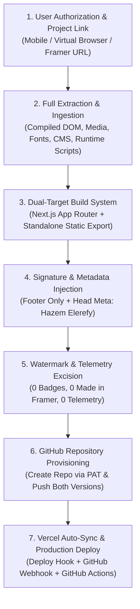

# Framer-to-Next.js End-to-End Extraction & Deployment Workflow

This document standardizes the repeatable engineering workflow for extracting Framer projects, rebuilding them with 100% fidelity in Next.js, applying custom attribution, removing all watermarks, and deploying with automatic GitHub-to-Vercel synchronization.

---

## 1. Workflow Architecture & Lifecycle



---

## 2. Detailed Phase Breakdown

### Phase 1: Authentication & Project Access
- **Scenario**: When initiating from mobile or remote environments without local browser interaction, access is coordinated via a virtual browser session or direct Framer project URL authorization.
- **Input**: The Framer project URL:
  `https://framer.com/projects/<project-name>--<project-id>`
- **Output**: Verified read access to project preview, published endpoints, and asset CDNs.

---

### Phase 2: Full Extraction & Asset Ingestion
- **Asset Mirroring**: Download all high-resolution imagery, responsive `srcset` resolutions, vector icons, SVG assets, and custom fonts to local storage (`public/images/`, `public/fonts/`).
- **CMS & Structured Data**: Extract all collection schemas, items, slugs, authors, tags, and relational data into structured JSON files (`data/`).
- **DOM & Physics Runtime Capture**: Mirror the compiled DOM trees, layout geometry, CSS modules, and Framer Motion client scripts across all routes (`/`, `/about`, `/projects`, `/projects/[slug]`, `/articles`, `/articles/[slug]`, `/contact`).

---

### Phase 3: Dual-Target Rebuild (100% Parity)
Handwritten approximations (e.g. naive Tailwind rebuilds) are strictly avoided because they fail to reproduce proprietary spring physics, easing curves, and complex keyframe animations.

1. **Target A: Modern Next.js App Router (`app/`)**
   - Implemented via Next.js App Router Dynamic Route Handlers (`app/route.ts` and `app/[...slug]/route.ts`).
   - Serves the compiled DOM structure, inline styling tokens, and original Framer Motion client runtime from `public/`.
   - Verified with static prerendering and production compilation: `npm run build` (0 errors).
2. **Target B: Standalone Static Export (`framer-export/static-site/`)**
   - Zero-dependency static bundle ready to serve from any static host, CDN, Nginx, or Python server.

---

### Phase 4: Signature & Attribution Standard
- **Footer Signature**: Injected strictly at the bottom of the page footer:
  ```html
  <div id="hazem-signature" style="position:relative; z-index:99999; width:100%; background:#000000; border-top:1px solid rgba(255,255,255,0.08); padding:24px 20px; text-align:center; font-family:Inter, -apple-system, BlinkMacSystemFont, sans-serif; font-size:13px; letter-spacing:0.04em; color:#888888;">
    Designed &amp; Developed by <a href="https://github.com/hazemelerefey" target="_blank" rel="noopener noreferrer" style="color:#ffffff; text-decoration:underline; font-weight:600; margin-left:4px;">Hazem Elerefy</a>
  </div>
  ```
- **Metadata Attribution**: Embedded in the `<head>` of every route:
  ```html
  <meta name="author" content="Hazem Elerefy">
  <meta name="creator" content="Hazem Elerefy">
  <meta name="designer" content="Hazem Elerefy">
  ```
- **Negative Constraint**: Zero signatures inside the navbar, hero section, or article body text.

---

### Phase 5: Watermark & Telemetry Excision
Every production output must be 100% watermark-free:
1. **Badge Container**: Completely excise `<div id="__framer-badge-container">...</div>` and inner link markup.
2. **Text Strings**: Eliminate all instances of `"Made in Framer"`, `"Made by Framer"`, and `"Create a free website with Framer..."`.
3. **Telemetry**: Remove Framer tracking scripts (`events.framer.com`).
4. **Editor Bar**: Strip local storage editorbar preload scripts (`__framer_force_showing_editorbar_since`).
5. **Generator Meta**: Replace `<meta name="generator" content="Framer ...">` with `<meta name="generator" content="Next.js">`.
6. **Automated Verification**: Run grep/regex scans across all 40+ HTML files to guarantee zero lingering watermark tokens.

---

### Phase 6: GitHub Repository Provisioning
- Authenticate via GitHub Personal Access Token (PAT).
- Provision the remote repository (e.g. `hazemelerefey/<repo-name>`).
- Push the complete project structure (Next.js App + `framer-export/` static export) to branch `main`.

---

### Phase 7: Vercel Production Deployment & Automatic Synchronization
To ensure commits on GitHub instantly deploy to Vercel without manual intervention:
1. **Deploy Hook Creation**:
   - Register a dedicated deploy hook on the Vercel project via Vercel REST API (`/v1/projects/{projectId}/deploy-hooks`).
2. **GitHub Webhook Installation**:
   - Install a `push` webhook on the GitHub repository (`/repos/{owner}/{repo}/hooks`) targeting the Vercel deploy hook URL.
   - Confirms automatic delivery (`HTTP 201 Created`) on every push to `main`.
3. **GitHub Actions Fail-Safe**:
   - Commit `.github/workflows/deploy.yml` to trigger and verify deployments on every push.
4. **Queue & Concurrency Management**:
   - Clear stalled or canceled deployments in Vercel to preserve the account's concurrent build slot.
   - Verify production promotion on the canonical URL (`https://<project-name>.vercel.app`).

---

## 3. Verification Checklist

| Checkpoint | Target | Expected Status |
| :--- | :--- | :--- |
| **Framer Parity** | Local Next.js (port 3000) & Static Export (port 8080) | 100% visual and interactive spring-motion match |
| **Signature Placement** | Page Footer & `<head>` Metadata | Present only in footer & meta; absent from hero/navbar/body |
| **Watermarks** | Whole Repository & Live DOM | 0 matches for `__framer-badge`, `Made in Framer`, `Create a free website` |
| **Telemetry** | Network requests & HTML script tags | 0 requests to `events.framer.com` |
| **Build Status** | Next.js Build (`npm run build`) | Exit Code 0, all static and dynamic routes compiled |
| **GitHub Repo** | `https://github.com/hazemelerefey/<repo>` | Both Next.js app and `framer-export/` pushed to `main` |
| **Vercel Sync** | GitHub Webhook + Deploy Hook | Active, delivering `HTTP 201 Created` on git push |
| **Production Domain** | `https://<project-name>.vercel.app` | Active, serving watermark-free Next.js build |
